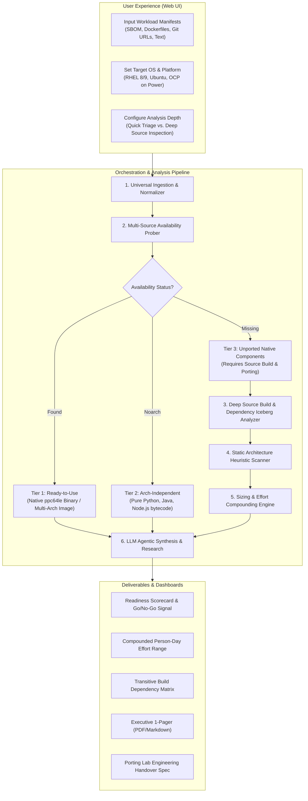

# IBM Power Porting Triage Agent: Architectural Blueprint & Implementation Plan

---

## 1. Executive Summary & Problem Statement

### 1.1 Context & Persona
- **Target Persona:** IBM Infrastructure sales specialists, technical pre-sales consultants, and client solution architects qualifying enterprise application migrations from x86/ARM to **IBM Power (`ppc64le`)**.
- **The Core Problem:** Enterprise customers provide heterogeneous, unstandardized application dependency manifests (e.g., mixed Dockerfiles, raw SBOMs, `requirements.txt`, spreadsheets, or loose application notes). Assessing whether these workloads can run on IBM Power is today a manual, fragmented, multi-day engineering effort.
- **The Estimation Gap:** When components lack ready-to-run Power binaries or multi-arch container images, teams have lacked a rapid, standardized heuristic to forecast the **person-day effort** needed to port and build from source.
- **The Business Impact:** Pre-sales qualification cycles take days or weeks, tying up senior porting engineers on non-viable deals, creating deal friction, and introducing scope risk into customer proposals.

---

## 2. End-to-End Solution Workflow



---

## 3. UI / UX Design Specifications

The user interface is designed for rapid qualification by pre-sales teams while preserving deep engineering drill-down capabilities.

### 3.1 Input Form Elements
1. **Target Deployment Environment:**
   - **Target OS & Version:** Red Hat Enterprise Linux (RHEL 8.x, 9.x), SUSE Linux Enterprise Server (SLES 15), Ubuntu (22.04 LTS, 24.04 LTS) for `ppc64le`.
   - **Platform Runtime:** Bare Metal, PowerVM LPAR, OpenShift Container Platform (OCP on Power).
2. **Workload Ingestion (Multi-Modal):**
   - **File Upload:** Drag-and-drop support for:
     - Software Bill of Materials (SBOM): CycloneDX (JSON/XML), SPDX (JSON/tag-value).
     - Container manifests: `Dockerfile`, `docker-compose.yml`, Helm `values.yaml`, K8s pod specs.
     - Package manifests: `requirements.txt`, `Pipfile`, `pom.xml`, `package.json`, `go.mod`, `Cargo.toml`.
     - Spreadsheet/Flat files: CSV, TSV, XLSX list of package names and versions.
   - **Git Repository / Container URL:** Public or private Git repo URL (GitHub, GitLab), or Docker image name (e.g. `quay.io/org/app:v1.2`).
   - **Free-Form Text Prompt:** Unstructured paste area where users can drop unstructured client notes, emails, or stack descriptions.
3. **Triage Mode & Depth Selection:**
   - **Express Triage (10–30s):** Performs registry and repo lookups only.
   - **Deep Source Build Audit (1–3 min):** Clones source repositories of unported components, recursively maps build-time dependencies, and scans for architecture-specific code patterns.

---

### 3.2 Output Dashboard Elements
1. **Executive Feasibility Scorecard:**
   - **Readiness Score:** Percentage of workload immediately executable on Power (e.g. `88% Porting Ready`).
   - **Traffic Light Recommendation:**
     - 🟢 **GO (Low Friction):** $\ge 90\%$ native, remaining items are trivial rebuilds.
     - 🟡 **CAUTION (Moderate Friction):** $70\% - 89\%$ native, contains unported C/C++ libraries with community builds or known porting recipes.
     - 🔴 **HIGH RISK (Significant Friction):** $<70\%$ native, proprietary x86 binary blobs, complex JIT compilers, or deep transitive dependency blockers.
   - **Effort Range:** Aggregated Person-Days with 90% confidence interval (e.g., `3.5 – 6.0 Person-Days`).
2. **Interactive Dependency & Build-Tree Matrix:**
   - Searchable, filterable table detailing:
     - Component Name & Requested Version.
     - Component Type (Container, OS Package, Language Library, Custom Binary).
     - Status: `Native Available`, `Platform Agnostic`, `Substitute Available`, `Unported (Build Required)`, `Blocker`.
     - Evidence / Source Links (Docker Hub multi-arch tag, RHEL RPM mirror, PyPI wheel tag, IBM Open-CE repo).
     - Individual Effort estimate in Person-Days.
3. **Unported Component Drill-Down Panel:**
   - Direct inspection of build requirements, toolchain prerequisites, assembly code snippets, and known mitigation strategies (e.g., using `SIMDe` or IBM Open-CE alternatives).
4. **Actionable Deliverables Export:**
   - **Download Pre-Sales Executive 1-Pager:** Clean PDF/Markdown brief for client sales proposals.
   - **Export Technical Porting Backlog:** CSV/JIRA-ready task list with build flags and dependencies for porting engineers.

---

## 4. Deep-Dive: Realistic Source Build & Transitive Dependency Scoping

For components that lack ready-to-run binaries, a simplistic estimate based purely on lines of code will fail. In practice, porting an unported library entails **building from source**, which frequently uncovers a **transitive dependency tree explosion**.

```
[Unported Component A]
        │
        ├── Build Toolchain Check: Requires Bazel 6.x (Does ppc64le Bazel exist?)
        │
        ├── Build-Time Dependencies (Build-Requires / Devel Headers):
        │     ├── Dep 1: OpenSSL-devel ───────────► [Available in RHEL ppc64le: 0 PD]
        │     ├── Dep 2: libdeflate-dev ──────────► [Available in RHEL ppc64le: 0 PD]
        │     └── Dep 3: custom-math-lib ─────────► [UNPORTED ON PPC64LE!]
        │                                                  │
        │                                                  ├── Requires AVX-512 intrinsic porting
        │                                                  └── Has transitive dependency Dep 4...
        │
        └── Source Code Architecture Sensitivity:
              ├── Inline x86 Assembly (__asm__ / immintrin.h)
              ├── Endianness Assumptions
              └── 64KB Page Size Sensitivity (Memory allocators / cache buffers)
```

### 4.1 The "Dependency Iceberg" (Build-Time Transitive Dependencies)
When a package must be compiled from source on `ppc64le`, the triage agent must parse its source build configuration to extract **Build-Time Requirements**:
1. **Manifest Extraction:**
   - C/C++: `CMakeLists.txt`, `meson.build`, `configure.ac`, `Makefile`, `vcpkg.json`, `conanfile.txt`.
   - Rust: `Cargo.toml` (native C build dependencies via `-sys` crates like `openssl-sys`).
   - Go: `go.mod` (checking for `CGO_ENABLED=1` native bindings).
   - Python: `pyproject.toml`, `setup.py` (checking `build-system.requires`, `cffi`, Cython extensions).
   - Linux Packaging: RPM `.spec` file `BuildRequires:`, Debian `control` `Build-Depends:`.
2. **Transitive Availability Verification:**
   - For every discovered build dependency, the agent recursively checks: *Is this build dependency available in the target OS repo or registry for `ppc64le`?*
   - If a build dependency is *also* missing, it is added to the porting backlog, recursively compounding the effort.

---

### 4.2 Build Toolchain & Environment Prerequisites
Building modern software often requires complex build orchestrators:
- **Bazel:** Historically challenging on Power due to embedded Java/C++ binaries. The agent checks if the required Bazel version has verified `ppc64le` releases.
- **LLVM / Clang / GCC Toolchain:** Verifies minimum compiler versions needed (e.g., C++20 support on older RHEL 8 environments).
- **Rust / Go Toolchains:** Checks whether the active language runtime has Tier-1/Tier-2 support on `ppc64le`.

---

### 4.3 Source-Level Architecture Sensitivity Audit
When cloning or inspecting source code of an unported component, the heuristic scanner looks for four architectural friction points:

| Pattern / Friction Point | Code Signature / Regex | Porting Implication & Remediation |
| :--- | :--- | :--- |
| **x86 SIMD / Intrinsics** | `<immintrin.h>`, `<x86intrin.h>`, `_mm256_*`, `_mm512_*`, `__AVX2__`, `__SSE4_1__` | Requires translation to Power Vector Multimedia Extension (VMX/VSX) or porting via header-only libraries like **SIMDe** (SIMD Everywhere). |
| **Inline x86 Assembly** | `__asm__ volatile ("cpuid"...)`, `rdtsc`, `pause`, architecture-specific register naming | Requires rewriting using standard C++ atomics, compiler intrinsics (`__builtin_*`), or Power `mfspr`/`sync` instructions. |
| **Page Size Hardcoding** | Assumes 4KB memory pages (`PAGE_SIZE 4096`, `mmap` alignment). | Power default in RHEL/SLES is typically **64KB pages**. Can crash or cause memory bloat in allocators (Jemalloc, RocksDB, LMDB). |
| **Endianness Assumptions** | Pointer casting tricks, network byte order assumptions without `htons`/`ntohl`. | Modern Linux on Power is Little Endian (`ppc64le`), but older C code sometimes mistakenly assumes all PowerPC is Big Endian (`#if defined(__powerpc__)`). |
| **JIT / Assembly Backends** | Custom JIT engines, V8 backends, LuaJIT, PyPy. | Very high effort ($> 10$ PD) if the JIT lacks a PowerPC instruction generator. |

---

### 4.4 Realistic Effort Sizing Model

The total estimated porting effort for an unported package $P$ is calculated as:

$$\text{Effort}(P) = \text{BaseBuildEffort}(P) + \sum_{d \in \text{UnportedBuildDeps}} \text{Effort}(d) + \text{ArchCodeComplexity}(P) + \text{ValidationEffort}(P)$$

#### Baseline Sizing Rules:
- **Level 0 — Ready / Out-of-the-box (0.0 PD):** Native binary / container exists in target repos.
- **Level 1 — Pure Rebuild (0.5 – 1.0 PD):** Clean C/C++/Go code, all build dependencies available in target OS, compiles cleanly with standard `gcc`/`clang`.
- **Level 2 — Build System & Toolchain Patching (1.0 – 2.5 PD):** Custom CMake/Bazel build scripts need arch flags, minor compiler warning fixes, or updating dependency links.
- **Level 3 — SIMD / Vector Acceleration Porting (2.5 – 5.0 PD):** x86 SSE/AVX intrinsics present; can be ported using `SIMDe` or replaced with scalar/VSX fallbacks.
- **Level 4 — Deep Transitive Iceberg (5.0 – 10.0+ PD):** Multiple unported build-time dependencies that each require compilation from source.
- **Level 5 — Major Refactor / Blocker (> 10 PD or High Risk):** Custom JIT compiler, hardcoded 4KB page size deeply coupled to disk formats, or proprietary closed-source x86 binaries (e.g., proprietary drivers/crypto engines).

---

## 5. Backend Architecture & Pipeline Modules

```
                    ┌──────────────────────────────────────────────┐
                    │            FastAPI REST API Layer            │
                    └──────────────────────┬───────────────────────┘
                                           │
                    ┌──────────────────────▼───────────────────────┐
                    │       1. Universal Ingestion & Parser        │
                    │  (SBOM, Dockerfile, requirements, Git clone) │
                    └──────────────────────┬───────────────────────┘
                                           │
                 ┌─────────────────────────┴─────────────────────────┐
                 │                                                   │
  ┌──────────────▼───────────────┐                   ┌───────────────▼──────────────┐
  │ 2. Multi-Source Prober       │                   │ 3. Deep Source Build Engine  │
  │ - Docker Hub / Quay API      │                   │ - Build-Requires extractor   │
  │ - RHEL / Ubuntu Repos        │                   │ - Transitive graph builder   │
  │ - PyPI, Maven, NPM, Go pkg   │                   │ - Source code ripgrep scan   │
  │ - IBM Open-CE / Power DevOps │                   │ - Toolchain readiness check  │
  └──────────────┬───────────────┘                   └───────────────┬──────────────┘
                 │                                                   │
                 └─────────────────────────┬─────────────────────────┘
                                           │
                    ┌──────────────────────▼───────────────────────┐
                    │      4. Effort Sizing & Compounding Engine   │
                    │   (Calculates PD ranges & confidence bands)  │
                    └──────────────────────┬───────────────────────┘
                                           │
                    ┌──────────────────────▼───────────────────────┐
                    │        5. LLM Agentic Reasoning Layer        │
                    │ - Multi-hop GitHub PR & Issue resolution     │
                    │ - Architecture code mitigation suggestions   │
                    │ - Executive proposal & 1-pager synthesis     │
                    └──────────────────────────────────────────────┘
```

### Module Breakdown:
1. **Universal Ingestion & Normalizer:**
   - Standardizes inputs into Package URLs (`purl`, e.g., `pkg:pypi/torch@2.1.0`, `pkg:docker/nginx@1.24`).
2. **Multi-Source Availability Prober:**
   - Queries container registries for multi-arch manifest lists containing `os: linux`, `architecture: ppc64le`.
   - Queries OS repositories (RHEL mirrors, EPEL, Ubuntu Ports) for binary RPMs/DEBs.
   - Queries language registries (PyPI wheels, Maven Central jar/so, NPM).
3. **Deep Source Build & Dependency Tree Analyzer:**
   - For missing packages: checks if public Git repository exists.
   - Parses build files (`CMakeLists.txt`, `setup.py`, `package.json`, `.spec`) to extract `BuildRequires`.
   - Recurses through unported build dependencies.
4. **Static Architecture Heuristic Scanner:**
   - Uses ripgrep to scan cloned source trees for arch-specific tokens (`immintrin.h`, `__x86_64__`, `PAGE_SIZE`, etc.).
5. **LLM Agentic Reasoning Layer:**
   - Handles ambiguity, searches online for existing patches/PRs, and translates technical findings into executive summaries.

---

## 6. Where LLMs Add Value

| LLM Capability | Operational Function | Value Delivered |
| :--- | :--- | :--- |
| **1. Unstructured Ingestion** | Extracts structured dependency lists from loose emails, architecture diagrams, or fragmented text pastes. | Zero customer friction during input collection. |
| **2. Multi-Hop Investigation** | When a package is not found, the agent uses tool calling to search GitHub/GitLab issues & PRs: *"Did someone already open a PR for ppc64le in library X?"* | Discovers unmerged community patches, slashing estimated effort from weeks to hours. |
| **3. Code Refactoring & Mitigation Reasoning** | Reads x86 SIMD code snippets flagged by the scanner and suggests exact porting paths (e.g. recommending `SIMDe` or Power VSX replacements). | Validates whether an intrinsic is trivial to replace or requires algorithmic rework. |
| **4. Alternative Package Recommender** | Suggests drop-in Power-optimized equivalents (e.g. recommending IBM Open-CE or OpenBLAS when Intel MKL is specified). | Bypasses unporting bottlenecks entirely by recommending existing alternatives. |
| **5. Executive Sales Synthesis** | Translates technical compiler warnings, build dependencies, and RPM tags into clean, compelling pre-sales qualification briefs. | Eliminates pre-sales delays and arms sales teams with authoritative answers. |

---

## 7. Phased Implementation Roadmap

### Phase 1: Core Triage Engine (Foundation)
- Build the FastAPI backend and data models (`ManifestItem`, `AvailabilityStatus`, `BuildDependency`, `TriageReport`).
- Implement the Multi-Source Availability Prober (Docker Hub, RHEL/Ubuntu ports, PyPI).
- Implement input parsers for `requirements.txt`, Dockerfiles, and SBOM JSON.

### Phase 2: Deep Build & Transitive Dependency Scoping
- Implement source build configuration parsers (`CMakeLists.txt`, `setup.py`, `package.json`, RPM `.spec`).
- Build recursive dependency graph resolver for unported packages.
- Implement ripgrep scanner for x86 SIMD, inline assembly, and page-size flags.
- Implement the compounded person-day sizing formula.

### Phase 3: LLM Agentic Intelligence
- Integrate Gemini 2.5 / 1.5 Pro via Python SDK with function calling.
- Add tools for GitHub issue/PR discovery and code snippet analysis.
- Build the automated Executive 1-Pager and Sales Proposal generator.

### Phase 4: UI Experience & Executive Dashboard
- Build a responsive web application featuring:
  - Multi-format ingestion zone (file upload, Git URL, freeform text).
  - Triage scorecards, traffic light indicators, and effort range widgets.
  - Interactive transitive dependency tree explorer.
  - One-click PDF/Markdown export for sales proposals.
